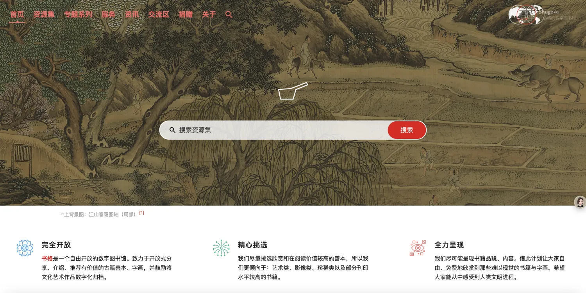
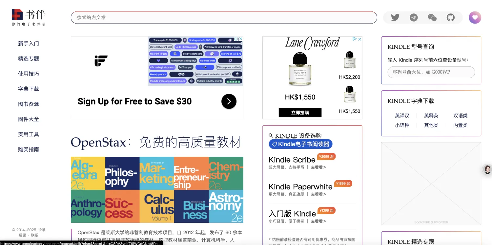
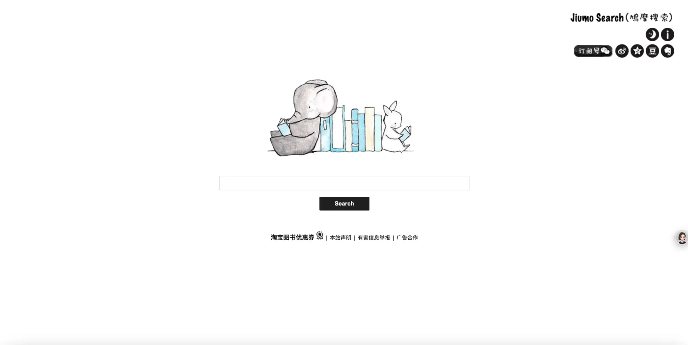

# 免费电子书网站

随着知识版权的完善，很多免费电子书网站都关停了，下面是收集了 3 个非常棒且在运营的免费电子书网站，同时里面链接了很多其他免费电子书网站，在阅读书籍的同时请大家尊重他人知识成果！

1. 书格是一个自由开放的数字图书馆。致力于开放式分享、介绍、推荐有价值的古籍善本、字画，并鼓励将文化艺术作品数字化归档。我们尽量挑选欣赏和在阅读价值较高的善本，所以我们更倾向于：艺术类、影像类、珍稀类以及部分刊印水平较高的书籍。我们尽可能呈现书籍品貌、内容。借此计划让大家自由、免费地欣赏到那些难以现世的书籍与字画。希望大家能从中感受到人类文明进程。点击查看网站 :point_right: [书格](https://www.shuge.org/)

    

2. 书伴更像是一个亚马逊书城的影子网站，但是它是更加以 Kindle 为核心的书籍生态圈，因为亚马逊中国书城已经退出中国市场，但是你如果有 Kindle 电子书阅读器，这个网站是非常不错的选择，提供了大量的免费图书，即使那些付费的（在这就不多说了，都懂的...）点击查看网站 :point_right: [书伴](https://bookfere.com/)

    

3. 鸠摩搜索是一个专门搜搜电子书的网站，提供了大量的免费电子书，页面简洁干净，搜索结果提供各种格式的电子书，方便在各种设备中阅读。:point_right: [鸠摩搜索](https://www.jiumodiary.com/)

    

因为免费电子书网站有些是用户贡献的，有些是管理员维护的，并没有非常严格的版权管理，所以在下载下来如果涉及分享就考虑版权问题，如何分辨是免费还是收费很关键，下面整理了一些方法！

1. 查看书籍本身信息
    1. 版权页：通常位于书籍的前几页或最后几页，会标明版权所有者、出版信息等。如果有版权声明，明确表示该书是免费授权或遵循某种开放版权协议，如知识共享协议（Creative Commons）等，那么可能是免费的。若版权页有出版社或版权方的版权声明，强调版权所有，未经许可不得复制、传播等，一般是收费的。
    2. 封面及前言等：部分免费书籍会在封面、前言或后记中明确说明该书是免费提供给读者的，或者有相关的公益性质、开源项目等介绍。收费书籍则通常会有定价信息，或提示读者购买渠道等。
2. 利用在线资源查询
    1. 图书馆数据库：查询当地图书馆的馆藏目录和电子资源数据库。如果图书馆有该书的纸质版或电子版馆藏，且读者可以免费借阅，说明该书在图书馆的授权范围内是可供公众免费阅读的，但这并不一定意味着该书在所有渠道都是免费的。一些图书馆购买的电子资源可能只供馆内读者使用，有一定的访问限制。
    2. 电商平台：在当当、京东、淘宝等大型图书电商平台上搜索该书。如果该书在这些平台上有售卖，且标明了价格，那么通常是收费的。若平台上未找到该书销售信息，或明确标注为免费电子书等，可能是免费的，但需进一步核实。
    3. 版权登记机构网站：如中国版权保护中心的网站，可通过相关检索功能查询书籍的版权登记信息，了解版权所有者及版权状态等情况，但该方法对于普通读者来说操作相对复杂，且查询结果可能不够直观。
3. 了解书籍的来源和性质
    1. 出版社或作者官网：访问出版社或作者的官方网站，查看该书的相关介绍和版权说明。一些知名出版社的官网会明确标注旗下书籍的版权和销售信息。作者个人网站也可能会说明其作品的授权方式，是免费分享还是需要购买。
    2. 开源或公益项目：如果书籍是基于开源项目、公益活动或特定的免费文化传播计划出版的，通常是免费的。例如，一些开源社区会组织编写并免费发布技术书籍，以促进知识共享和技术传播。
    3. 学术机构或政府出版物：部分学术机构、政府部门发布的研究报告、白皮书等，可能会免费向公众开放，以传播知识和信息。但也有一些学术著作可能由出版社出版并需要购买，具体需根据相关机构的规定和版权声明来判断。

下面的网站是版权登记查询网站和图书数据库网站，在做版权查询时可能会使用到！

1. 版权查询
    1. 中国版权保护中心：https://www.ccopyright.com.cn
    2. 国家版权局：https://www.ncac.gov.cn/?c=99	
2. 图书馆
    1. :point_right: [国家图书馆](https://www.nlc.cn/)
    2. :point_right: [高校图书馆](http://www.calis.edu.cn/)
    3. :point_right: [浙江图书馆](https://www.zjlib.cn/)
    4. :point_right: [湖北省图书馆](https://www.library.hb.cn/)
    5. :point_right: [国家科技图书文献中心](https://www.nstl.gov.cn/)
    6. :point_right: [全国图书馆咨询联盟（强烈推荐）](http://www.ucdrs.superlib.net/)